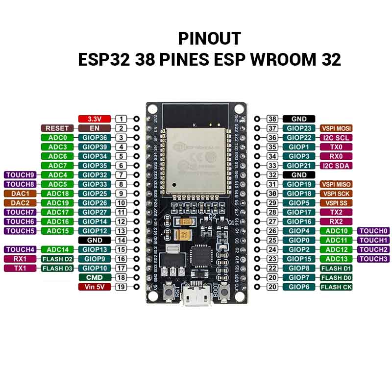

# Maquinas_digitales
## Repositorio correspondiente al curso de Máquinas Digitales, grupo 8327, de la Facultad de Ciencias, UNAM

El ambiente de trabajo usado para este curso es 
- Windows 10, 21H2
- Instalación de CP210x_Windows_Drivers
- Arduino IDE 2.0.3
    -  File > Preferences > Additional boards manager urls: https://dl.espressif.com/dl/package_esp32_index.json
    - Tools > Board > Boards Manager > Boards Manager, search for esp32 by Espressif Systems
- AWS CLI
- Python 3.9

## Índice
Aquí enlistaremos links al código y comentario de las prácticas. Hacer click para ser redirijido a los markdowns. También se puede acceder mediante la interfaz de Github, haciendo click en la carpeta correspondiente

- **[S3 | Blink, Serial y ADC](https://github.com/CarlosDanPVST/maquinas_digitales/blob/main/S3_practica/entrega_s3.md)**

### Notas generales
Para configurar en específico ARDUINO IDE para nuestro microcontrolador seguimos estas instrucciones
> Tools > Board > esp32 > DOIT ESP32 DEVKIT V1

Lo cual nos permite generar el código correcto para nuestro microcontrolador. Además debemosde elegir el "Puerto COM" al cual se encuentra conectado el microcontrolador: para ello se accede al *Administrador de dispositivos* en Windows, y se busca *Puerto COM*. Hacemos la coincidencia entre Arduino IDE y el puerto mostrado

Es importante tener en mente que ESP32 se refiere a la unidad de procesamiento y otras especificaciones, sin embargo, la placa sobre la cual está montada puede variar de modelo a modelo. La siguiente imagen representa nuestro caso particular

Expliquemos parte de la terminología de la imagen:
- `EN` -> Enable, pin de habilitación de regulador 3.3V
- `GIOPx` -> General Input Output Pin, pin de uso general, numerado en la placa
- `ADCx` -> Analogic-Digital Converter, convertidor de señal
- `TOUCHx` -> Entrada touch
- `DACx` -> Digital-Analogic Converter, convertidor de señal 
- `GND` -> Ground, tierra eléctrica

C es análogo a Java; existen diversos tipos primitivos para trabajar, y una sintax para trabajar con funciones. Por ejemplo `void recursion(int x){...}` es una función que acepta un parámetro entero, realiza alguna rutina y no devuelve nada. Otro ejemplo puede ser `int fourier(float x){... return -1;}`. 

No obstante, existen diferencias significativas. Por ejemplo, se usan <b>macros</b> y se declaran las variables, normalmente, en métodos especiales. 