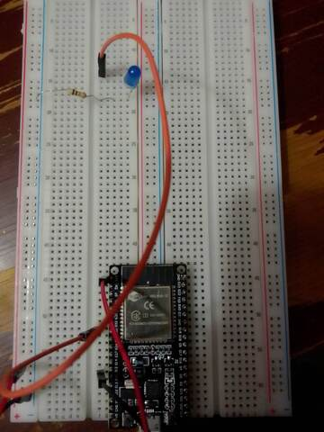
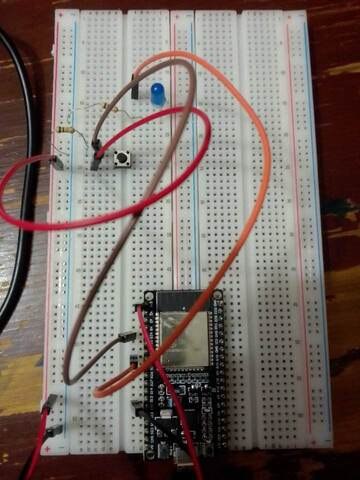
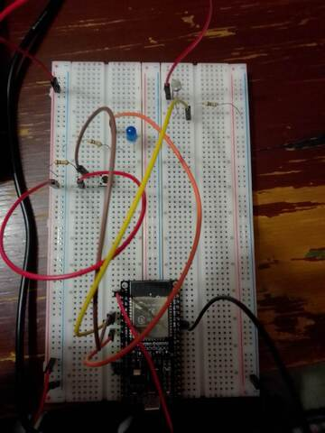
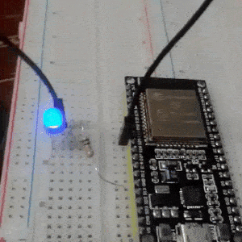
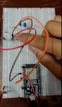
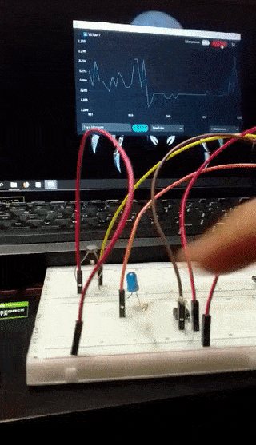
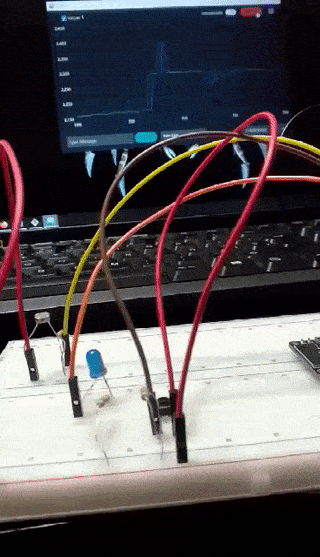

A continuación mostramos los circuitos que se montaron en la protoboard    

El código del Blink se encuentra **[aquí](https://github.com/CarlosDanPVST/maquinas_digitales/blob/main/S3_practica/Blink/Blink.ino)** y fue hecho basado en el ejemplo que provee Arduino IDE. El siguiente video muestra el led azul del circuito prendiendo y apagando   

Dicho endendido y apagado es ciclíco, y depende de código estático. Para ello usamos el circuito del botón y el código que yace **[aquí](https://github.com/CarlosDanPVST/maquinas_digitales/blob/main/S3_practica/Button/Button.ino)**. El video muestra su funcionamiento 

*¿Qué desventaja encuentras a la forma de leer el botón con este programa?* Leer de este modo el botón evita la automatización de nuestro proyecto; automatizar es un objetivo de programar, por ello leer el botón así es una desventaja

El LDR (Light Dependent Resistor)  nos permitirá que nuestro mmicrocontrolador reaccione a "estímulos externos", en este caso la luz en el ambiente. Nuestro programa, **[aquí presente](https://github.com/CarlosDanPVST/maquinas_digitales/blob/main/S3_practica/LDR/LDR_umbral/LDR_umbral.ino)** , logra esto, y reacciona encendido u apagando el led. Se presentan dos vídeos de dicho funcionamiento, uno en el que no existe un umbral, y otro en el que sí

