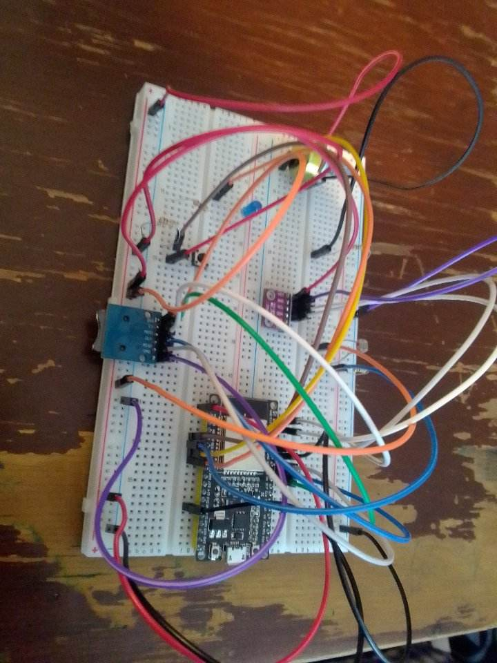
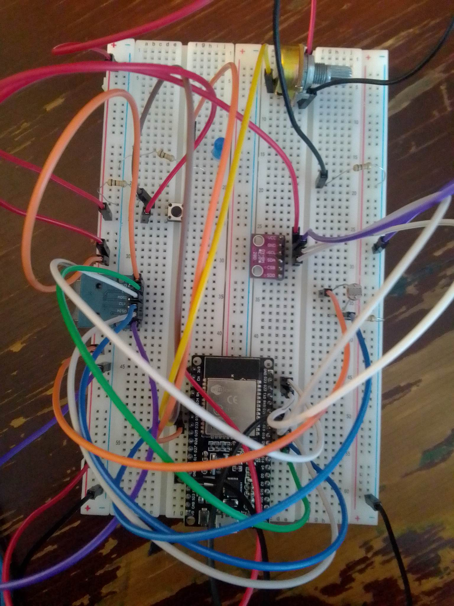
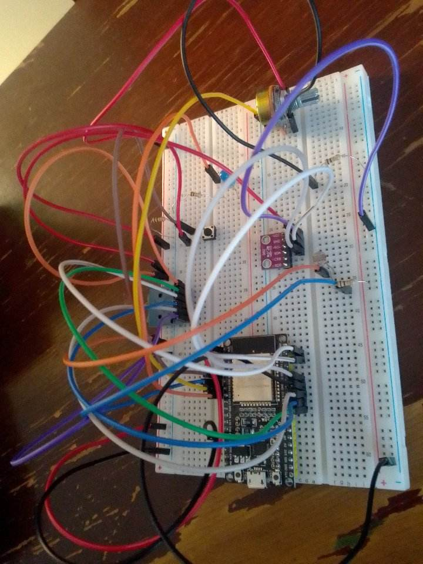
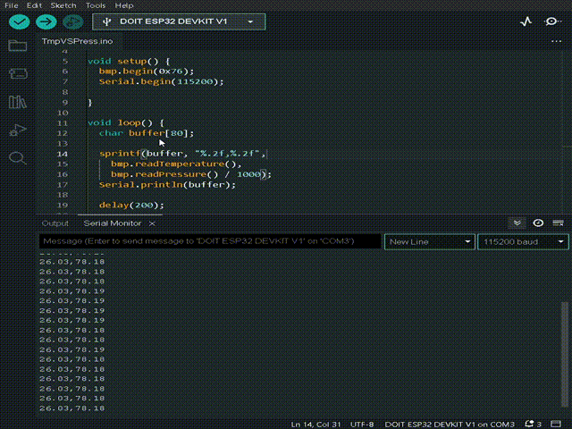
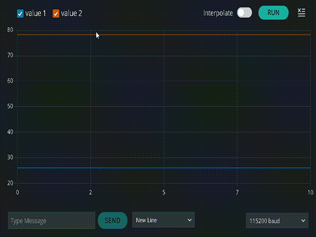
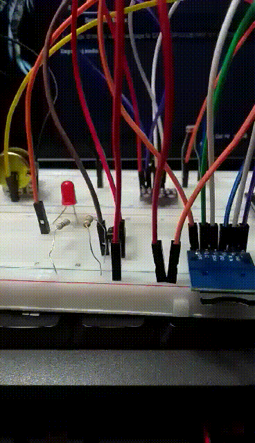

### PROTOCOLO SPI E I2C

En las siguientes fotografías se pueden apreciar los circuitos para el BMP
y el lector de tarjetas SD

    
    
    

*¿Por qué es adecuada la decisión de usar el protocolo I2C para comunicar al 
sensor atmosférico y el protocolo SPI para comunicar al lector de tarjetas uSD?* 

// añadir respuestas 

### SENSOR ATMOSFÉRICO

Obtuvimos la dirección en memoria de nuestro sensor BMP280 mediante
**[este código](https://github.com/CarlosDanPVST/maquinas_digitales/blob/main/S4_practica/WireScan/WireScan.ino)**. Se buscan las direcciones mediante fuerza 
bruta, en el ciclo-for de la línea 22. La línea 27 inicia una transmisión a cada dirección 
en memoria que recorre el for, esto con el objetivo de recibir un *acknowledgement*.
Si se recibe respuesta no-errónea se imprime la dirección en memoria,
bloque-if de la línea 30. Si ocurre un [transfer timeout](https://docs.particle.io/reference/device-os/api/wire-i2c/endtransmission/)
se imprime un mensaje de error y la dirección en memoria, bloque if
de la línea 39. 
La imagen muestra el resultado obtenido

    

Una vez con nuestra dirección de memoria, que resultó ser **0x76**, podemos 
hacer lecturas con nuestro sensor BMP280. Los siguientes videos muestran 
las lecturas hechas por el sensor. Las lecturas se realizaron con el código de
**[sensor_atmosferico](https://github.com/CarlosDanPVST/maquinas_digitales/blob/main/S4_practica/TmpVSPress/TmpVSPress.ino)**

      

      

### LECTOR DE TARJETAS

Para probar la configuración del lector de tarjetas seguimos el ejemplo
mostrado en <code>File > Examples > SD(esp32) > SD_TEST</code>. Serial
Monitor nos mostró lo siguiente

    

Una vez establecido esto, podemos guardar en un archivo las lecturas de 
sensores. **[Este código](https://github.com/CarlosDanPVST/maquinas_digitales/blob/main/S4_practica/SD/SD.ino)** muestra un programa para hacerlo: mediante
él guardamos las temperaturas, presiones y luminosidades registradas. 
Como señalización para saber que se están guardando registros, elegimos 
encender y apagar un led, y mandar a consola un mensaje, como lo muestra 
el siguiente video

    

Los datos obtenidos pueden visualizarse **[aquí](https://docs.google.com/spreadsheets/d/1fjc-rRQkJ4_6d5SeXgI-R8LTbiPJ2A-gHWyVaT-hTrs/edit?usp=sharing)**
, y se corresponden con las siguientes imágenes

    
    
    

