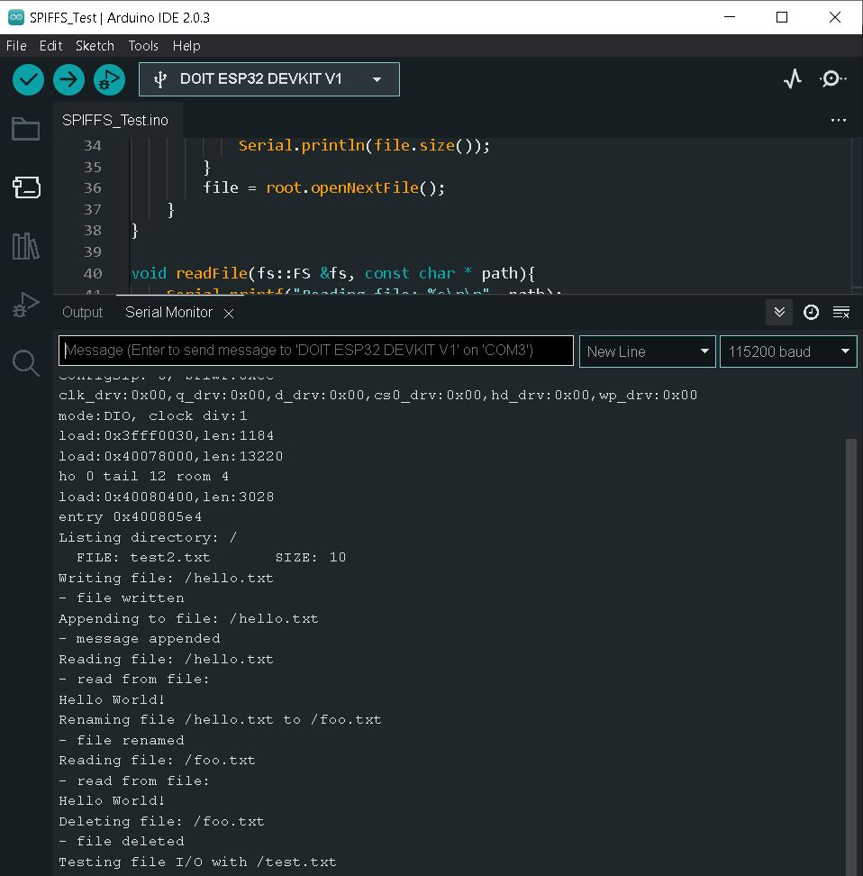
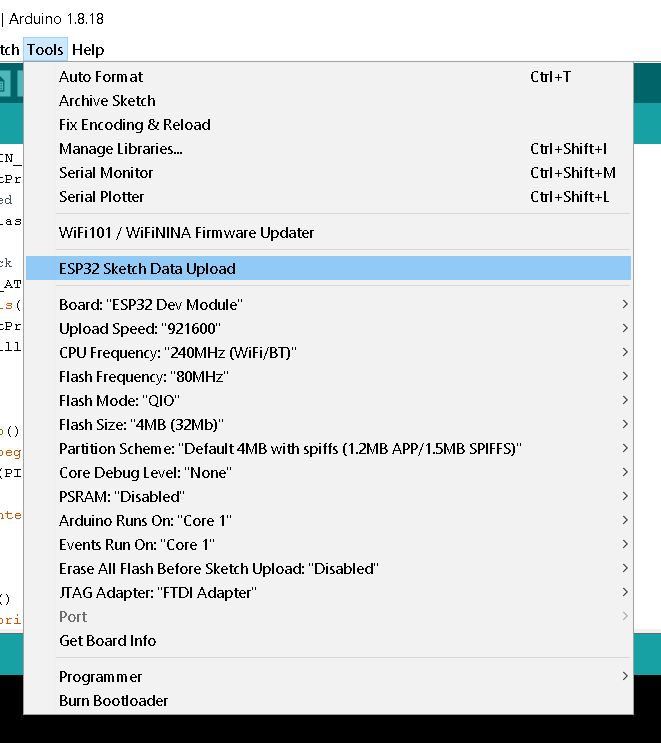
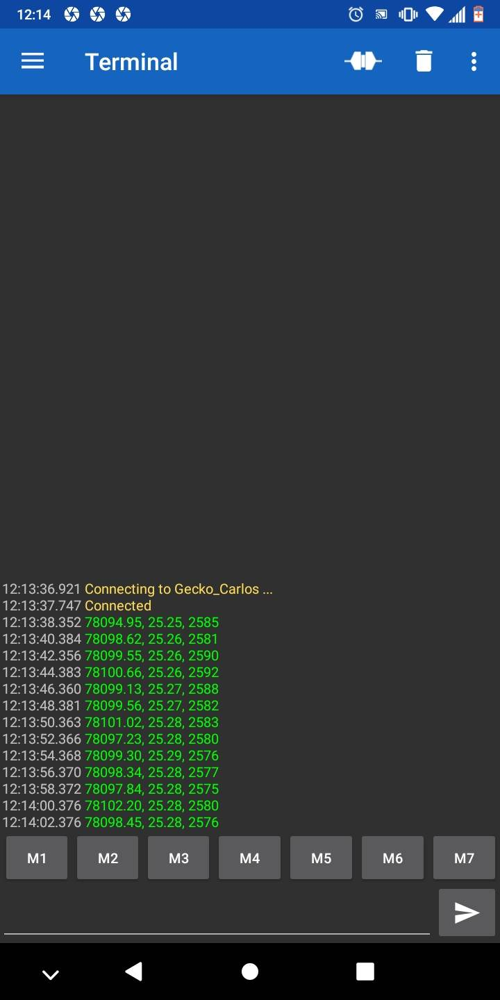
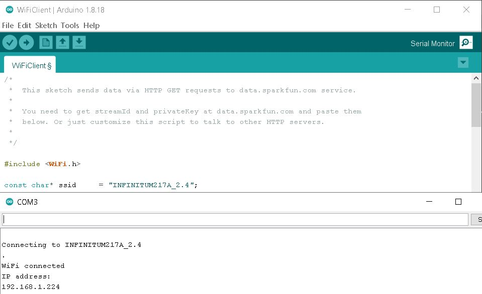
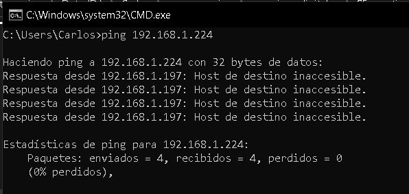
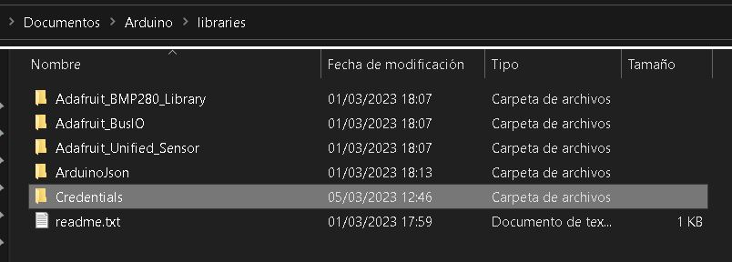

**Json Parser y SPIFFS**

A continuación se muestra el resultado de correr la prueba para el sistema de archivos 
SPIFFS hallada en <code>File > Examples > SPIFFS > SPIFFS_Test</code>

    

_¿Para qué queremos un sistema de archivos como SPIFFS? Da un ejemplo de uso._  

Para poder usar este sistema de archivos necesitamos hacer uso de la extensión mostrada
a continuación

    

_¿Por qué no podemos instalar Sketch Data Upload en Arduino IDE V2?_  
La razón es simple, la extensión no ha sido actualizada para funcionar en Arduino IDE V2,
 pues éste último es reciente a la fecha de escrito este reporte

---------------- falta pto 5 y pto 6 -----------------------------------

**Módulo RF**

------ falta pto 1 -------------
A continuación se muestra la recepción, a través de bluetooth, de las lecturas 
hechas por nuestro sensor BMP.

 

Nuestro ESP32 también puede conectarse a redes WiFi, como se muestra a continuación

 

El uso del comando <code>ping</code> en Windows 10 muestra lo siguiente

  

Como es mala práctica hardcodear cualquier información sensible, hicimos uso de un 
archivo para almacenar dicha información. Este archivo se nombró <code>Credentials.h</code>

 

 

_¿Podemos usar simultáneamente WiFi y Bluetooth con ESP32?_  
No, pues ambos usan la misma frecuencia para comunicarse, así que debemos usarlos
a conciencia

_¿Por qué creamos Credentials.h?_  
Como ya dijimos, la información sensible, _como la contraseña de nuestro modem_, NO
debe ser hardcodeada. El uso de <code>Credentials.h</code> nos permite ejecutar 
nuestros programas con dicha información almacenada _solo a nivel local_, por lo que
al hacer push de la evidencia permanecemos seguros.

Por últimos, mostramos los programas **[Bluetooth_logger]()**
y **[Conexion_WiFi]()** que se usaron en esta semana